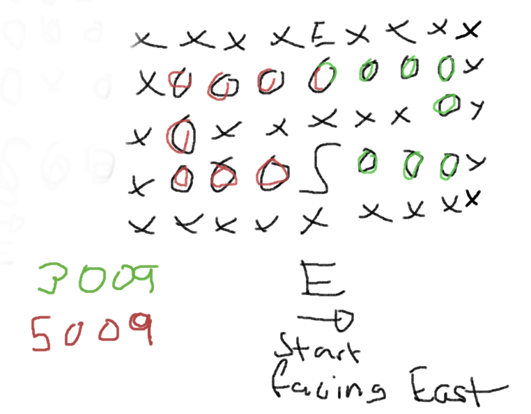

# 16 reindeer maze

## Path finding

Fun solution today where you can essentially employ any path finding algorithm of choice. What's important is to understand that you can simply incorporate the rotation costs into the path finding algorithm by utilizing the information of previous direction compared to current direction, this will be the cost of your next step.

When using bfs you simply make sure that you do not get stuck in loops by not adding new nodes for a path if the node has been traversed before e.g.
```python
if (nx, ny) in path:
    continue
``` 
You will find all best paths. However, this will add many suboptimal paths that can be pruned earlier. For this problem specification you know that if you get to a node that you have previously visited with where the previous path got there with a cost of 1000 less than the new paths cost we know that the new path can't be better because no matter how we got there for the previous path we can afford to turn making it an equal or better choice than the new path. Since the only time a new path landing on a visited (x, y) that is more costly than the previous path can be better is if we do not have to rotate on (x, y) with this new path since rotations are very costly. 



In the example above the red path can be pruned when looking at the next point before E since the cost of the green path will be at cost 2008 and can therefore afford turning whatever way it wants without the red path being an equal or better choice.

In code this would be the check:

```python
if (x, y) in visited and visited[(x, y)][0] < (steps - 1000):
    continue
```

Obviously we need strictly less than (<) since if we get there in the same amount of steps with a turn that will be a possible best path. This pruning reduces runtime from minutes (..didn't wait to get exact ⏲️💀) to 1 second.


## Rotation

I started of with a naive rotation cost map just mapping out each direction swap and its cost. Of course a much cleaner solution is something like the following:

```python
def rotation_cost(v1, v2):
    if v1 == tuple(-x for x in v2): # Opposite direction
        return 2000
    elif sum(a * b for a, b in zip(v1, v2)) == 0: # Perpendicular directions
        return 1000
    else:
        return 0
```

Since we are working with unit vectors we can easily calculate if they are perpendicular by their sum being 0 for x1*x2, y1*y2 and opposite by flipping one of the directions and comparing for equality.